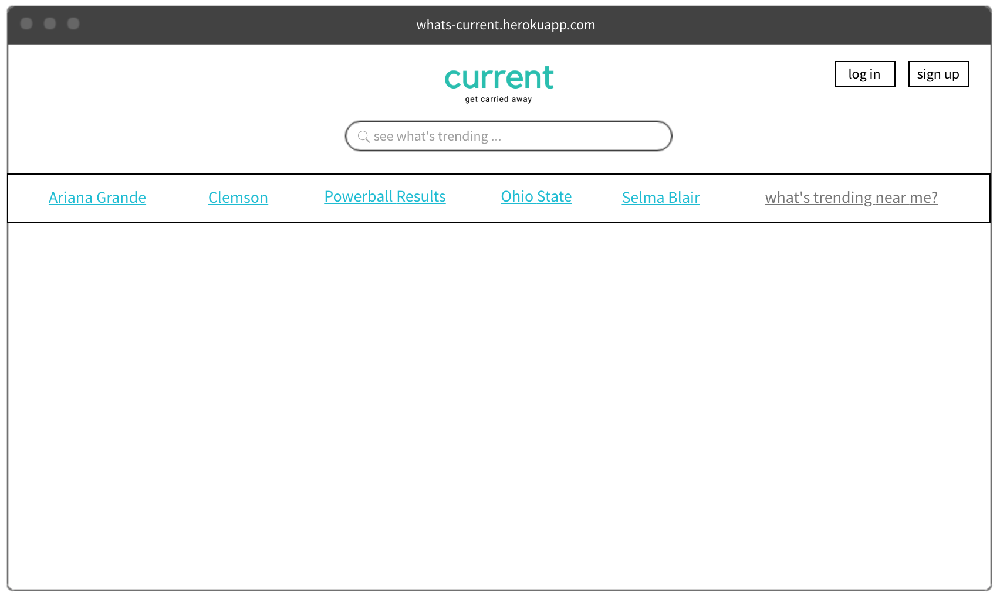
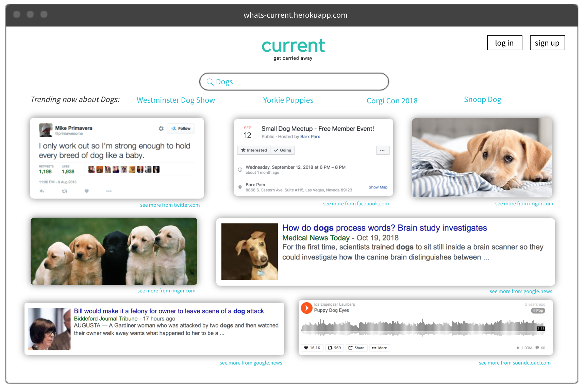

# Current
[current live](https://whats-current.herokuapp.com/)

*A website that lets you see trending posts from multiple websites, all in one place*

## Background and Overview

Search for a topic and Current shows you related posts from multiple big websites. If you're not sure what you're looking for, Current also provides you some options based on what's trending right now.

If you want to save your search terms, you can make an account and easily search for things you've search for before.

Current is built with a MERN Stack (MongoDB, Express, React, node.js) and uses GoogleTrendsAPI, NewsAPI, and imgurAPI.

## Functionality and MVP

* User auth with login/signup forms
* Logged in users can save search terms
* Search bar that dispatches to multiple APIs
* Trend data from GoogleTrends, with ability to search multiple APIs
* News API that displays news articles related to search term
* imgur API that displays images related to search term

### Bonus Features

* Ability to filter trending results based on location
* More APIs to show data from (Youtube, giphy, etc)
* Related search terms
* Word cloud for trending terms

## Technologies & Technical Challenges

Current is a heroku webapplication with a backend built with MongoDB to save user auth and favorite search terms. Most of the data for the site will come from APIs: GoogleTrends, News, and imgur.

**Backend: MongoDB/Express**
**Frontend: React/Node.js**

### Backend

Current will be a single page application. User's do not have to login to use the site, but there is an option to login on the mainpage if a user wants to save search terms.

* Current will only have two models: Users and SearchTerms
* Relations between the two should be simple to query
* API data will not be stored in the database

Technical Challenges:

Since most of the data for the site will be coming from different APIs, we will need to be able to dispatch the same action to multiple APIs at once, while returning data in a similar structure from each API so that the frontend will know how to render each component.

Each API should return data with a type (ie: news) and content (the results of the search). We will need to isolate the relevant data to render it on the page (ie imageUrls for imgur).

### Frontend

Splash page:

Search results:

Data from each API will need to be rendered on the page. 

Technical Challenges: 
The state will need to be updated based on API calls that return different kinds of data. The data from news sites will be formatted differently from the data from imgur. The frontend should hold data that looks similar to the site it's representing, while also looking appealing all together.

## Accomplished over the Weekend

* All members read the MERN tutorials
* Wrote up Readme and planned work for the next week
* Got API calls to work for our selected APIs and got back data
* Set up project skeleton

## Group Members & Work Breakdown

**Sam McClure, Elena Churilov, Wade Coufal, Riya Kulkarni**

### October 20-21

* Build project skeleton - **Elena**
 * Investigate imgur and GoogleTrends APIs - **Wade**
 * Investigate Youtube and News API, write proposal - **Sam**
 * Plan frontend layount - **Riya**

 ### Day 1 
 * Finish building User Auth backend- **Elena**
 * Create methods to get info from APIs return relevant data, start building frontend components - **Wade and Sam**
 * Get GoogleTrends requests and connect to frontend - **Riya**
 * Discuss how we want to display returned API info on the frontend -**All**

### Day 2
* Build User Auth frontend and start building database for search terms -**Elena**
* Get APIs styled on frontend -**Sam and Wade**
* Get user search and trends to connect to APIs -**Riya**

### Day 3
* Add functionality for saving search terms and using them to make requests to the APIs -**Elena**
* Finish debugging APIs and make sure they show up correctly, pick second APIs and start working (Youtube and Reddit) -**Sam and Wade**
* Add related search terms to user's search -**Riya**

### Day 4
* Discuss how the project is coming along and what else needs to be done -**All**
* Setup seed data/demo user -**Elena**
* Work on filtering trends by location -**Riya**
* Get second APIs working and displaying -**Sam and Wade**

### Day 5
* Add possible word cloud functionality
* Make sure all APIs are working correctly, add new ones if time

### Day 6-7
* Finish styling/debugging/refining -**All**
* Complete Production README

